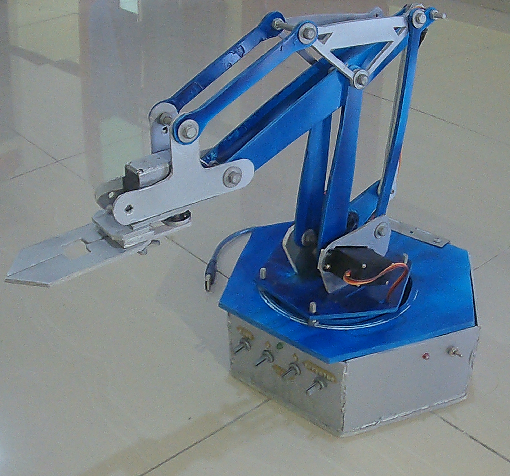
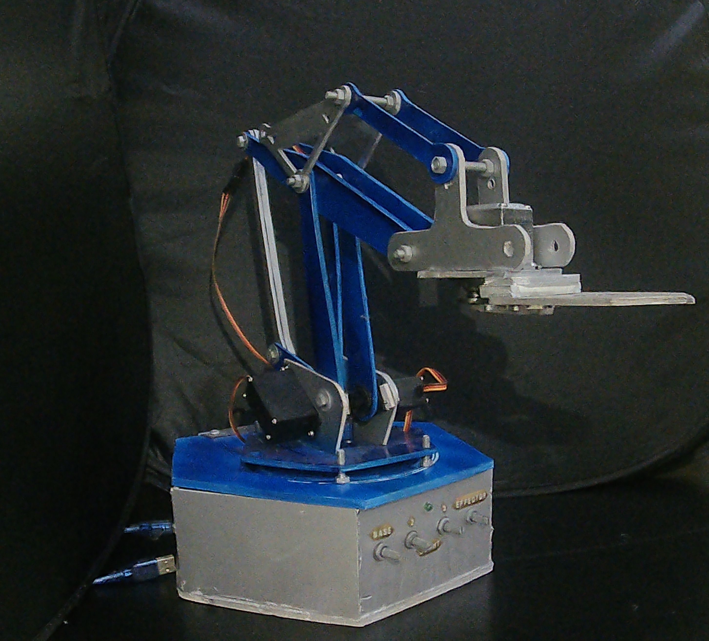

# 🤖 Arm Robot Project

This project is a 4-DOF robotic arm controlled by Arduino UNO using potentiometers.  
It demonstrates basic control and lifting ability for small objects.

---

## 📋 Components Used
- Arduino UNO  
- MG995 Servo Motors  
- 10kΩ Potentiometers  
- PVC Foam Body  
- LED Indicator  

---

## 🧠 Features
- Manual control using potentiometers  
- Arm can lift loads up to **30 cm** high  
- LED indicator for motion status  

---

## 📄 Project Report
[View Full Report](./Arm_Robot_[HEXABOT]Report.pdf)

---

## 🎥 Demo Video
🎬 [Watch the demo here](https://youtu.be/7xYwMZ2bofc?si=lU2-q9NWqkLuqLyb)

---

## 📷 Images
| Front View | Side View |
|-------------|------------|
|  |  |

